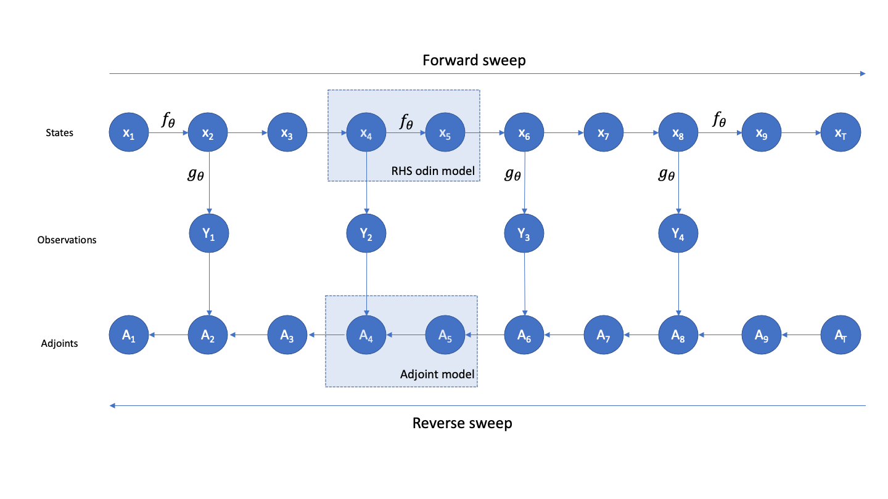

State space models (SSM) have their own structure which make them suitable for certain algorithm. We are interested here in the impact on automatic differentiation (AD). We assume that we have a SSM with a number of input and that some information from the states of the system are compared with observations at regular interval. Assuming independent observation, the fitness of the model can be seen etc.

Let's consider the following odin model



$$\bar{v_{i}} = \frac{\partial f} {\partial v_{i}}= \sum \limits_{j:\text{child of }i} \bar{v_{j}} \frac{\partial v_{j}}{\partial v_{i}}$$

We need to be able to reverse the computational flow in order to propagate the impact of the parameter on the value of the target function.

```{r}
parsed_model <- jsonlite::fromJSON(odin::odin_parse("models/sir_4_AD.R"))


plot_reverse_path <- function(parsed_model, state){
  parameter_graph <- NULL
  index_up <- which(paste0("update_",state)==parsed_model$equations$name)
  for(n in seq_along(parsed_model$equations$name)){
    #browser()
        if(!is.null(parsed_model$equations$depends$variables[n][[1]])){
          if(parsed_model$equations$name[n] %in% parsed_model$components$rhs$equations)
          for(p in eval(parsed_model$equations$depends$variables[n][[1]]))
            parameter_graph <- rbind(parameter_graph,
                                     c(p,parsed_model$equations$name[n]))
          }
  }
  igraph::graph_from_edgelist(parameter_graph)
}
```

# Derivation of the adjoint odin programme

We need to build an adjoint odin programme for the reverse sweep. For this we need to use the structure of the original odin programme. For this we need to study the structure of dependence to list the child variables.

```{r}
construct_param_tree <- function(parsed_model){
  parameter_graph <- NULL
  for(n in seq_along(parsed_model$equations$name)){
    #browser()
        if(!is.null(parsed_model$equations$depends$variables[n][[1]])){
          #if(parsed_model$equations$name[n] %in% parsed_model$components$rhs$equations)
          for(p in eval(parsed_model$equations$depends$variables[n][[1]]))
            parameter_graph <- rbind(parameter_graph,
                                     c(p,parsed_model$equations$name[n]))
          }
  }
  igraph::graph_from_edgelist(parameter_graph)
}

param_graph <- construct_param_tree(parsed_model)
names(param_graph["S",which(param_graph["S",]==1)])
param_graph["beta",]
```

```{r}
print(parsed_model$source)
```


